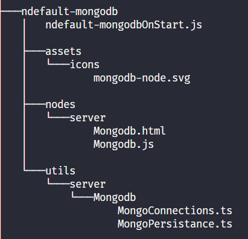

# SD Node Development Guide

## **Nodes**

A Node encapsulates scripts to be executed in a flow of a service. It may change the flow object or execute some scripts based on the inputs from the user during the execution of the flow.

There is a common way of making a Node for both Client and Server service designer and be made available for both Client and Server.

### **Creating A Node**

Creating a Node can be logically seperated out into the following aspects:

1. **HTML** (_required_) - Scripts and HTML for the registration and view of the Node .
2. **JS** (_required_) - All logic related to scripts code generation with respect to run-time execution of the flow in the generated app should be written in this file.
3. **Assets** (_required_) - Icons for the Node.
4. **OnStart script** - Scripts that run before the server starts. Their code generation logic reside in this file.
5. **Utils** - Utility files which contain functionalities to be consumed by the Node at run-time of the app.

There are two types of **category** for the Node:

1. **Config Node** - This node saves configurations required by other Nodes.
2. **Node** - Default

Each Node has three **Service Type**:

1. **Client** (value: `client`)
2. **Server** (value: `server`)
3. **Common** (value: `common`) - If no value is given for `serviceType` property in the [node registration object](#registerNode-Options), the node is considered to be a `common` node and will be registered for both the `client` and `server` services.

Following diagram depicts a typical structure of a `Nodes Package` once its installed in the workspace (`$HOME/.neutrinos/plugins/marketplace-components`). A Nodes package can have any number of Nodes. The diagram below shows Mongodb feature bundled into a Nodes Package.

#### **Nodes File Structure**



For now, let us focus our attention to the `nodes` folder where all the `HTML` and `JS` files are put together by **Service Types**. This separation based on service types helps the Studio to figure out when and how to register a Node. Therefore, based on your requirements you can have three folders inside the `nodes` folder: `client`, `server` and `common`. `common` nodes gets loaded for both Client and Server services editor. Inside each of these folders you should put your `JS` and `HTML` file for the corresponding Node to be registered.

### **n-packages.json**

Before delving in-depth into Node development, let us first understand the JSON structure to be followed while publishing a `Nodes package`. Following details and naming conventions should be followed while publishing the package:

1. **name** (_required_) (`string`) - Unique name for the package. It is recommended that you have your Organisation name prefixed the package name to make sure it stays unique. Example: `neutrinos-mongodb`. Package names are always to be lower cased.
2. **packageType** (_required_) (`string`) - Always **"studio-nodes"** for `Nodes package`.
3. **displayName** (_required_) (`string`) - Display name to be shown the dependencies list in the Plugins Manager UI.
4. **version** (_required_) (`string`) - Version of the package to be uploaded.
5. **nodes** (_required_) (`object`) - Nodes object consists of the list of nodes with keys of serviceTypes:

6. 5.1\. `client` | `server` | `common` (_required_) (`array`)

  - 5.1.1\. The array of Node names or an object of `name` and `dependencies` list.

    - 5.1.1.1\. **name** (_required_) (`string`): This name should be the same as the file names of HTML and JS files for the Node.
    - 5.1.1.2\. **dependencies** (`array`):

      - 5.1.1.2.1\. **name** (_required_) (`string`): Name of npm package to be downloaded and added to the app when the Node is installed in the app.
      - 5.1.1.2.2\. **version** (_required_) (`string`): Vrsion of the npm package to be downloaded and added to the app when the Node is installed in the app.

```json
{
    // Instead of "ndefault", please prefix this
    // with your Organisation name
    "name": "ndefault-mongodb",
    "packageType": "studio-nodes",
    "displayName": "Mongo DB",
    // Every time a Nodes package needs to be
    // uploaded this version should be incremented
    "version": "1.0.0",
    "nodes": {
        "server": [
            {
                // This node name should exactly match
                // the file name present inside the
                // serviceType folder.
                // This name ensure that Mongodb.html
                // and Mongodb.js are loaded at launch
                // of the service editor in Studio
                "name": "Mongodb",
                // Dependencies list, which will be
                // installed in the end app
                "dependencies": [
					{
						"name": "mongodb",
						"version": "3.6.3"
					},
					{
						"name": "bson",
						"version": "4.2.2"
					}
                ]
            }
        ]
    }
}
```

### **Node View**

A Node from the User's perspective has three views:

- **palette view** (drag and droppable icon in the palette list),
- **canvas view** (node which can the connected and used in a flow of a service) and
- **attributes view** (where configurations for a node is done.)

All of the configurations for these views can be done in a single HTML file.

This HTML file can be split into two script tags:

#### **Template**

```html
<script type="text/x-red" data-template-name="[unique nodeType name here]">
<!-- Here lies the content of the editor form. Example, inputs-->
  <div class="editor-form-row">
      <input type="text" id="node-input-name">
  </div>
</script>
```

#### **Node Registration**

Registering a node lets the Neutrinos Studio know about how to render the node and its behaviour in variuos scenarios(See [Node's Lifecycle Hook](#Lifecycle-Hooks-for-a-Node)).  
To register a node, call the `registerNode` method with the node registration object.  
See the [registerNode Options](#registerNode-Options) section for the properties within this object to know about customizing the node's appearance and behaviuor.

```html
<script type="text/javascript">
  registerNode({
    // This object is the node registration object
    // All the required options for node registeration
    nodeType: '[unique nodeType name here]'
  })
</script>
```

#### **registerNode Options**

- **nodeType** (_required_): `string` - Unique name for registering Node type which should be the same as the names of the HTML and JS files.  
  Example:  

  - **nodeType**: neutrinos_mongobundle_mongodb,

  - **JS file**: neutrinos_mongobundle_mongodb.js, **HTML file**: neutrinos_mongobundle_mongodb.html_).

> **_IMPORTANT_**  
> `data-template-name` attribute in the [Template](#Template) and `nodeType` value in node registration object should be same for successful registration of the Node.

- **serviceType** (_optional_) (`client` | `server`) - If not given, it is taken as `common` which means that the Node is registered for both Client and Server Services editor.

- **docsLink** (_required_) `(string | funciton(serviceDesignerType: "client" | "server"): {nodePath: string} | {fullPath: string})`

Example:

```javascript
// As a string
docsLink: 'start-node'

// As a function #1 - that returns only the nodepath
docsLink: function(serviceDesignerType) {
    return {
        nodePath: 'start-' + serviceDesignerType + '-node';
    }
}

// As a function #2 - that returns the entire url
docsLink: function(serviceDesignerType) {
    return {
        fullPath: 'docs.official.website/node-docs/' +  serviceDesignerType + '/start-node';
    }
}
```

- **nodeDef** (_required_) (`object`)

  - **inputs** (_required_):0 | 1 - Number of inputs to the Node.
  - **outputs** (_required_):`number` (>=0) - Number of outputs from the Node.
  - **color** (_required_):`string` - Color of the Node in the canvas view. It should be a valid css compatible color name or hex string.
  - **paletteLabel** (_required_): `string` | `() => string` - Text to be shown as label in the palette list of the Service editor where the Node is registered.
  - **label** (_required_): `string` | `() => string` - Text to be shown as a label on the node when it is present in the canvas view.
  - **labelStyle** (_required_): `string` | `() => string` - Label can be italicised by giving a string input as `node_label_italic`. Otherwise, the name of the node should be passed as input.
  - **icon** (_required_) (`string`): Path of the icon which will show up in the palette view and when the node is dropped in canvas view. Naming format - `node_pacakge_name/icon_file_name_with_extension`. Example, "neutrinos_icon_bundle/mongo_node.svg". It is recommended that icons be of type SVG. For the icon to be successfully, it should be located inside the `assets/icons/icon_file_name_with_extension.` of the package folder.
  - **category** (_optional_) (`string`) - The category of the palette list the Node should appear in. For example, "Function". If you make a category that does not exist it will create a new section in the palette list for this Node.
  - **isClassFunction** (_optional_): `boolean` - By default, "Name" and "Function Name" fields will be created and attached to the attribute window of a non-config node. Opt out of this feature by setting this to `false`.  
  - **inputLabels** (_optional_): `string` | `Array<string>` | `() => string | Array<string>` - Label which will show up on hover of the input port of the Node.
  - **outputLabels** (_optional_): `string` | `Array<string>` | `() => string | Array<string>` - Label which will show up on hover of the output port/ports of the Node.
  - **shape** (_optional_): `'circle'` | `'square'` - Is "square" by default, if no value is provided. Note that all _Start_ Nodes are of "circle" shape by convention.

    > **_Node Object:_** Before going any further let us try to grasp the design of the Node Object. Each Node that is part of the flow is nothing but a JSON object that affects the view and code generation. During save of a particular service this JSON object with other information about the flow is saved. However, the Code generation of the Node will only be triggered when it is connected via Start Node or it is of type Start. **_A Node developer can configure this Node Object via defaults option in nodeDef._**

- **defaults** (_optional_): `Record<string, any>`: Consider defaults object to be similar to variable declaration from a programming perspective. These properties will get populated into the **Node object** with their default values and will change based on user inputs. User can give inputs to these properties via input fields mapped to these defaults properties.  
A mapping of the input field can be done by using naming convention for id attribute of a input field:    `id="node-input-{property}"` for `<input>`, `<select>` fields or `id="node-typed-input-{property}"` for [`typedInput`](#5\.-typedInput-widget) field.  

Following the naming convention has a perk of auto-remapping of the saved values of the Node back the attributes view when the attributes window of a Node is opened by double-clicking. So, when the user opens the attributes window he will see whatever values he had entered previously or see the default values.

  - **Node Default Properties**:

    - **value** (_optional_): `any` - Initial value for the property which gets auto-populated if the input-field property naming convention was followed.
    - **validate** (_optional_): `RegExp` | `(currentValue: any, ServiceDesignerInstance)) => boolean` - This is used for validation of the property after a node is added to the canvas and after the node is edited. It should return `true` or `false`.
    - **required** (_optional_): `boolean` - If the input-field property naming convention is followed, and the there is no default value assigned for the property then the Node is invalid unless the User opens the attribute window and propulates the field with some values and clicks on the **Done** button. This is optional, however, it is recommended to use this property
    - **type** (_optional_): `string` - By giving this property a value which is equal to the `nodeType` of a config node, you can enable your node to read/modify the corresponding config.
    - **attrDef** (_optional_): `{ attrType: string, label?: string, options?: any, validatesform?: boolean}` - Defines what type of element (`input`, `toggle-button`, `select` or `typedInut` ) to render in the node's `Attribute`. See [Create View Using Config](#Create-View-Using-Config) for more details.

Example for "defaults" object: (Snippet from the "HttpOut" server node)

```javascript
defaults: {
        // input text fields
        name: { value: '' },
        // headers
        headers: {
            value: {
                type: 'bh.input',
                value: ''
            }
        },
        // response body
        responseBody: {
            value: {
                type: 'bh.input',
                value: ''
            },
            validate: function (v) {
                return (this.responseType === 'next' ||
                server.validators.patterns.noblank.test(v.value));
            }
        },
        httpcode: { value: '', validate: function (v) {
                return (this.responseType === 'next' ||
                server.validators.patterns.noblank.test(v));
            }
        },
        responseType: { value: '', required: true },
        responseMapping: { value: '', },
        cookies: { value: [] },
        // ports
        inputs: { value: 1 },
        outputs: { value: 0 },
        editableListData: {
            value: {
                headers: [],
            }
        },
        cookiesList: {
            value: {}
        },
        switchStates: {
            value: {
                headers: 'Map',
                cookies: 'Map'
            }
        }
    }
```
> **NOTE:**  
> A property named "functionName" will be created/overriden on the "defaults" object for any non `config` nodes.
> This property will be used for storing and validating the "functionName" value generated based on 
> the value of the "name" input field. "functionName" generated will be used as name of the wrapping functions around the node's
> logic. See [Node Code Generation](#Node-Code-Generation) for more details on "wrapping". This will help increase the code 
> readability for the end user.  
> 
> The HTML for these fields will also be attahced by default for each non `config` node.
> 
> You can opt out of this feature by setting "isClassFunction" of the `nodDef` object to `false` in registerNode options


> **NOTE:**  
> The Attribute window for a Node can be queried using
>
> ```javascript
> const form = $("#dialog-form");
> let __$ = form.find.bind(form);
> ```
>
> The Attibute window for a Config Node can be queried using
>
> ```javascript
> const form = $("#node-config-dialog-edit-form");
> let __$ = form.find.bind(form);
> ```
>
> "`__$`" can now be used to query any DOM element from ONLY within the node's attributes window. Using "`__$`" makes it impossible to query elements from the other parts of Neutrinos Studio. this is a BEST PRACTICE.

#### **Lifecycle Hooks for a Node**

- **afteradd** (_optional_): `(SD: ServiceDesignerObject) => void` - This function is called after the node is added to the set of the flows objects in a service. `this` in this conext is the node object.
- **initdefaults** (_optional_) `(node, SD: ServiceDesignerObject) => Record<string, any>)` - `this` in initdefaults `context` refers to the `defaults` Object of the current Node Instance. This function can be used to change the defaults objects dynamically based on the requirements. You can add or remove defaults properties as well. The first argument is the node object and second is the SRD object. This function is not supported for config nodes. This function gets called when the Node is loaded into the canvas view i.e. at the opening of the Service Designer if the Node is already in the Canvas View or when it is dragged and dropped into the Canvas View.
- **oneditinit** (_optional_): `(SD: ServiceDesignerObject) => void`) - This is the first function that is called when a Node is double clicked inside the Canvas view. This event can be used to dynamically attach DOM elements to the form. Called before `oneditprepare`. To be used to attach dynamic UI widgets.
- **oneditprepare** (_optional_): `(SD: ServiceDesignerObject) => void` - This function is called after Node's attribute window's property-mapped input-fields has been re-mapped with the correct values from the defaults.
- **oneditsave** (_optional_): `(SD: ServiceDesignerObject) => void` - This function is called after Node's attribute window's _Done_ button is clicked. Here, you can change the Node Object to help with Code generation.
- **onpropertiesvalidated** (_optional_): `(SD: ServiceDesignerObject) => void` - This function is called after `oneditsave` and all input-field mapped properties are validated against the validate method provided in the defaults object. Here, as well you can cahnge the Node Object with correct values to help with Code generation.
- **oneditcancel** (_optional_): `(SD: ServiceDesignerObject) => void` - This function is called when the Attributes window's Cancel button is clicked by the User.
- **oneditresize** (_optional_): `(SD: ServiceDesignerObject) => void` - This function is called when the Attributes window is resized.
- **onpropertieschange** (_optional_): `(changes: any, valid: boolean, SD: ServiceDesignerObject) =>` - The `changes` argument will contain the old values of the changed properties discovered in this changedetection cycle. `valid` argument contains the validity (`true` | `false`) of the node before the current values of the node got validated. This hook is invoked after node's properties are changed and validated (just after "oneditsave") or when "undo" operation is performed.
- **afterservicerename** (_optional_): `(SD: ServiceDesignerObject) => void` - This function is called if the service where the Node is being used is renamed.
- **onservicesave** (_optional_) `(function(SD) => void)`: This function is called when save is called for the service.

#### **Create Attribute View Using Config**

**A faster but limited approach for populating defaults and generating fields in attribute window**

This will take care of input-fields creation and form validation for the `defaults` properties.  
**Steps**

- Define the `attrDef` object for each of the `defaults` object property in the \${nodename}.HTML file.
- Properties of `attrDef` object

  - **attrType** (_required_) ([`INPUT`](#1.-inputField-widget) | [`TOGGLE_BUTTON`](#3.-toggleButton-widget) | [`SELECT`](#2.-selectField-widget) | [`TYPED_INPUT`](#5.-typedInput-widget)): Based on the value of attrType property, it will generate the corresponding widgets.
  - **label** (_required_) (`string`): Label text to be used for that field
  - **options** (_required_) : `options` object expected by the each type of widget. Refer to **`options`** section under each [widgets documentation](#JQuery-Widgets)

Example:  
`TestNode.html` (Refer "nodeDef" topic under [Registering NodeType](#Node-Registration) for the other `nodeDef` properties' description)

```html
<script type="text/x-red" data-template-name="TestNode"></script>
<script type="text/javascript">
  registerNode({
      nodeType: 'TestNode',
      nodeDef: {
          color: "black",
          defaults: {
              testdata: {
                  value: 'Default test data; Changes should reflect back;',
                  attrDef: { attrType: 'INPUT', options: { placeholder: 'testdata', required: true  } }
              },
              thisisthenewdefault: {
                  value: 'test you',
                  attrDef: { attrType: 'INPUT', options: { placeholder: 'thisisthenewdefault' } }
              },
              anothernewdefault: {
                  value: 'another test you',
                  attrDef: { attrType: 'INPUT', options: { placeholder: 'anothernewdefault' } }
              },
              testinganotherone: {
                  value: 'testinganotherone',
                  attrDef: { attrType: 'INPUT', options: { placeholder: 'testinganotherone' } }
              },
              amqpConfig: {
                  type: 'amqp-config', value: {}, required: true, options: {},
                  attrDef: { label: 'AMQP Config' }
              },
              checkbox: {
                  value: false,
                  attrDef: {attrType: 'TOGGLE_BUTTON', options: {label: 'A togglebutton'}}
              }
          },
          .
          .
          .
          // Other properties
      }
  });
</script>
```

The above config will result in the creation of DOM elements for each default property that is inline with the recommended style and typography.

> NOTE:  
> **Limitations**:
>
> - No support for [Editable list widget](#4.-editableList-widget).
> - Switching between fields is not currently supported in this. It has to be manually implemented in "[oneditprepare](#Lifecycle-Hooks-for-a-Node)" hook

### **JQuery Widgets**

#### 1\. **inputField widget**

**Permitted usable HTML attributes**

- **placeholder** (_optional_): `string`
- **required** (_optional_): `string`

Example:

```html
<!-- <plaintext placeholder> -->
<input type="text" id="cookies-name" placeholder="Name" required />
```

**inputField Options**

- **inputClassList** (_optional_): `string` - Space seperated classes.
- **placeholderClassList** (_optional_): `string` - Space seperated classes.
- **placeholder** (_optional_): `string` - Text to show as input field's placeholder.
- **attrs** (_optional_): `{ [key: string]: any }` - JSON object keys(attr name) and values(attr value). This will add custom attributes to the input field.
- **props** (_optional_): `{ [key: string]: any }` - JSON with keys(prop name) and values(`true` / `false`).
- **value** (_optional_): `string` - Default value for the inputField.
- **validateOnCreate** (_optional_): `boolean` - Whether validation should run as soon as the widget gets created.
- **validatorRegexp** (_optional_): `RegExp` - JavaScript Regular Expression Object to validate the input value against.
- **errorText** (_optional_): `string` - Custom error message when the input value fails the test against pattern.
- **errorClassList** (_optional_): `string` - Space seperated classes,
- **required** (_optional_): `boolean` - true if the inputField is required.
- **disabled** (_optional_): `boolean` - true if the inputField should be disabled.
- **validator**: `(inputValue: string) => {valid: boolean, errorMessage: string}` - Function called on 'input' event to the inputElement. It should return validity and associated errorMessage (if invalid).
- **updations**: `(elmData: any, inputValue: string) => void` - Called after the input value validation.
- **onError**: `() => void`: Function that gets executed if the inputfield value becomes invalid.

**Dynamically Updatable Options**

- **placeholder**
- **attrs**

  Example

  ```javascript
  // updating "placeholder" after initialization
  $("#node-input-name").inputField("option", { placeholder: "asdasdas" });
  ```

**Widget methods**

- **show**: Display the widget.
- **hide**: Hide the widget.
- **toggle**: Hides if displayed. Shows if hidden.
- **reset**: Clears the value and clears the data associated with the inputField.
- **valid**: Get the validity of the inputField. Returns a boolean.
- **value** (v): Use this to correctly set the value. If 'v' is empty, it returns the current value.

**Usage Example:**

```javascript
$("#node-input-name").inputField({
  validator: function(v) {
    let valid = true;
    let msg = "";
    if (!SD.validators.patterns.validbh.test(v)) {
      valid = false;
      msg = "Name should contain alphanumeric chars";
    } else if (
      SD.nodes
        .workspaceNodes(node.type, node.id, "name", node.z)
        .nodePropsArr.includes(v)
    ) {
      valid = false;
      msg = "Middlewarestart node with the same name exists in this workspace";
    }
    return {
      valid: valid,
      errorMessage: msg
    };
  },
  validateOnCreate: true,
  disableDoneIfInvalid: true,
  enableDoneIfValid: true
});
```

#### 2\. **selectField widget**

**Properties**

- **placeholder** (_optional_): `string` - Text to show as input field's placeholder. If not provided the first option is displayed empty.
- **change** (_optional_): `value (string) => void` - This functional is called whenever a new value is selected.
- **value** (_optional_): `any` - Initial value to be assigned to the widget.
- **optionsData** (_required_): `Array<{value: string, displayValue: string, description: string}>` - Each option has the following properties

  - **value** (_required_): `string` - Value of the widget when the option is selected.
  - **displayValue** (_required_): `string` - Value to be displayed for the option.
  - **description** (_optional_): `string` - Tooltip for each options.

    ```html
    <select id="node-input-selectFieldname"></select>
    ```

    To give tooltip for the option, define a property "description".

    Example:

    ```javascript
    {value: 'application/json', displayValue: 'JSON', description: "Select this if the server sends json data"}
    ```

- **optionsgroupData** (_optional_): `array` - To show grouped options in the dropdown.  
  { [**Group Name**]: { **id**: `string`: Value of the option, **name** (`string`): Display value of the option, **description**: `string`: Tooltip for the option.}}

```javascript
$("#node-input-selectFieldname").selectField({
  optionsgroupData: [
    {
      "group 1": [
        { id: "opt1", name: "option1" },
        { id: "opt2", name: "option2" }
      ],
      "group 2": [
        { id: "opt3", name: "option2" },
        { id: "opt4", name: "option3" },
        { id: "opt5", name: "option4" }
      ]
    }
  ],
  value: node.encoding,
  change: val => {
    validateForm();
  }
});
```

**Widget Methods**

- **updateOptions**: `(optionsData, clearOldOptions (optional) (boolean), preserveSelected (optional) (boolean)) => void` - Used to update new options with flags. `clearOldOptions` flag will delete all existing options before adding the new options. `preserveSelected` flag will not clear the existing selection while updating the options.
- **selected** `(compeletedObject? boolean) => any` - Get the current select value. If `completedObject` flag is sent as `true`, then, it returns { `value`: Value of the current selected option., `displayValue`: Display value of the current selected option.}
- **clearSelection**: `() => void` - Clears the current value and selects the placeholder by default.
- **valid**: `() => boolean` - Checks if the selected value is valid and returns a boolean.

#### 3\. **toggleButton widget**

#### options

**Properties**

- **desciption** (_optional_) (`string`) - tooltip string.
- **cssObject** (_optional_) (`object` - Example options, `{ height: '10px'}`) - CSS will be applied on the outermost element of the toggleGroup.
- **label** (_required_): `string` - Label for the button toggle.
- **labelCss** (_optional_) (`object` - Example options, `{ color: 'red'}`) - CSS for styling the togglebuttn label.
- **states** ({on: `string`, off: `string`}) - Name for the 'on' and 'off' states.
- **labelId** string - `id` applied for the label
- **inputId** (_required_): `string` - Id applied to the input and used in the label for attributes and it will treated like clicking on the associated input element
- **containerId** (_required_): `string` - adds th id to the container of the toggle button
- **afterToggle** `(checked: boolean) => any` - Executed after the button has been toggled (either on or off). ​

**Widget Methods**

- **toggleOn**: toggle on the button.
- **toggleOff**: toggle off the button.
- **state**: Get the assciated state of the current button position. If no state option was provided, returns `true` or `false`

**Usage Example:**

```html
<input type="checkbox" id="node-input-useProxyAuth" />
```

```javascript
$("#node-input-useProxyAuth").toggleButton({
  label: SRD._("httpProxy.label.useProxyAuth"),
  labelCss: {
    "margin-right": "3em"
  },
  cssObject: {
    "margin-top": "1.5em"
  },
  // Provide state
  states: {
    on: "use",
    off: "donotuse"
  },
  afterToggle: updateProxyAuth
});

// Get the current state
const state = $("#node-input-useProxyAuth").toggleButton("state");
// "state" now contains 'use' or 'donotuse' string as per the 'states' options object
```

#### 4\. **editableList widget**

When the requirement entails an input field which populates a dynamic list where each item in the list maybe a widget and the list maybe sortable and each item can be deleted by user action. You may prefer to use this widget.

**Properties:**

- **addButton**: `boolean` | `string` - Text for Add Button label.
- **showAddBtnLabel** (_optional_): `boolean` - By default, an add icon is displayed for adding items to the list. By enabling this option you enable the text given to _addButton_ to be displayed.
- **height** (`number` | 'auto') - A number given as input is considered to be in pixels.
- **connectWith** (_optional_): `string` - CSS selector for other sortables.
- **sortable** (_optional_): `boolean` | `string` - if `string` then the value should be a CSS selector for the handle
- **removable** (_optional_): `boolean` - Displays a delete button for every item on the list.
- **scrollOnAdd** (_optional_): `boolean` - Auto scrolls the list when a new item is added to the list.
- **resizeItem** (_optional_): `item => void` - This functional is called when Attribute window is resized by the user and can be used for resizing individual items.
- **sortItems** (_optional_): `items => void`: After sorting if the order of items changes. A new items list is an argument for this funcation.
- **resize** (_optional_): `() => void` - This function is called when the list as a whole is resized.
- addItem (_optional_): `(row (Row element), index (index where the item is added), itemData (data assigned to the row)) => void` - This function is called when a new item is added to the list.
- **removeItem** (_optional_): `(itemData) => void` - This function is called when an item is removed from list.
- **filter** (_optional_): `(itemData) => boolean` - This function is called for each item, based on the boolean returned, the item is shown or hidden.
- **sort** (_optional_): `(itemDataA, itemDataB) => Number` - For sorting by ascending order return itemDataA.value - itemDataB.value. For sotring by descending order turn itemDataB.value - itemDataB.value.
- **validator** (_optional_): `() => boolean` - This function is called before the item is added to the list. If it returns false, then the item is skipped (not added to the list).

**Widget methods**

- **addItem**: `(itemData:any) => void` - Adds a item to the list.
- **removeItem**: `(itemData:any) => void` - Removes an item from the list. _itemData_ is the object that identifies the item to be removed.
- **width**: `(width : number) => void` - Sets the width of the editableList. This must be used in place of the standard jQuery.width() function as it ensures the component resizes properly.
- **height**`(width : number) => void` - Sets the height of the editableList. This must be used in place of the standard jQuery.height() function as it ensures the component resizes properly.
- **items**:`() => void` - Gets an Array of all list items. Each item is the jQuery DOM element for the item. Each element stores the original data for the item under property called data.
- **empty**: `() => void` - Clears the list of all items. This does not trigger any callbacks.
- **filter**: `((data) => boolean)) => void` - Filters the list to show/hide items based on the active filter function and returns the number of visible items. Takes callback function that return `boolean`.
- **sort**(`function`) - Sorts the list using the active sort function.
- **length**() - Gets the number of list items.
- **checkUnique**( items (`array`)): Checks if the array has duplicate values.

#### 5\. **typedInput widget**

A replacement for a regular `<input>` that allows the type of the value to be chosen, including options for string, number and boolean types.

**Type Definition**  
A Type Definition object describes a type that can be offered by a typedInput element.

- **value** (_required_) (`string`) - The identifier for the type
- **label** (_optional_) (`string`) - A label to display in the type menu
- **options** (_optional_) (`array`) - If the type has a fixed set of values, this is an array of string options for the value. For example, ["true","false"] for the boolean type.
- **constants** (_optional_) (`boolean`) - Set to false if there is no value associated with the type.
- **validate** (_optional_) (`function`) - A function to validate the value for the type.

**Properties:**

- **types** (_required_): `Array< string | {value: string, label: string, validate?: RegExp | (type: string, value: string) => boolean, constant?: boolean, options?: { label: string, value: any }[]>` - List of types that will show up in the selectable types list of the widget. It can be a string or an object with the properties mentioned. If it s a `string` it has to have the value listed below. This is the list of predefined selectable types which already have their types defined:

  - **"str"** - Any user input will be stringified. The value sent for the {Node}.js will be equivalent to `JSON.stringify({User Input Value})`
  - **"num"** - Any user input will be parsed to number. Validation of number will be present when this type is selected.
  - **"bool"** - The value field will be a dropdown options `true` and `false`.
  - **"server_env"** - A user can choose to write any environment variable that has been created using Environment Editor for server or both. The code generation in the server app files will be `process.env.{User input Environment variable}`
  - **"client_env"** - A user can choose to write any environment variable that has been created using Environment Editor for client or both. The code generation in the client app files will be `bh.system.environment.properties.{User input Environment variable}`
  - **"literal"** - Whatever the User types in the input field will exactly get tranformed to Code generation.
  - **For FlowVariable(bh) Mapping**: bh object is the flow object.A user can choose to map any key of the bh object.

    - **"bh."** - The value sent for the `{Node}.js` for codegen will be `bh.{User input value}`

    - **"bh.input"** - Map any key of bh.input. The value sent for the `{Node}.js` for codegen will be `bh.input.{User input value}`

    - **"bh.local"** - Map any key of bh.local. The value sent for the `{Node}.js` for codegen will be `bh.local.{User input value}`

    > **NOTE**  
    > The above types have been rigorously tested. If you create your own type just send an object to the types array following the `TypeDefinition` schema below.
	>
    > ```typescript
    > type TypeDefinition = {
    >    value: string, label: string,
    >   validate?: RegExp | (type: string, value: string) => boolean, 
    >    constant?: boolean,
    >    options?: { label: string, value: any }[]
    > }
    > ```

- **change** (_optional_): `(selectedType: string, currentVal: string, validity: boolean) => void` - This function gets called on the `change` event of value field or when a different type is selected by the user.

- **onvalchanged** (_optional_) `(selectedType: string, currentVal: string, validity: boolean) => void` - This function gets called on the `input` event of value field.

**Widget methods**

- **types**: `(types: Array< string | {value: string, label: string, validate?: Regexp|()=>boolean, nullable?: boolean, nullableValue?: any, constant?: boolean}>) => void` - Sets the types for the widget instance.
- **validate**: `() => boolean`- Validates the current `value` of the widget for the selected type according to the corresponding `validate` logic and returns the result.
- **type**: `(type?: string)=> void | string` - Sets the type of the widget if "type" is present. Otherwise, returns the selected `type`.
- **valid**: `() => boolean` - Returns the `validity` of the widget for the set `value` and `type`. This differs from the `validate` in that this does not re-run the validation logic, but only tells you the current validity.
- **value**: `(val?: string)=> void | string` - Sets the value of the widget if "value" is present. Otherwise, returns the selected `value`.
- **show**: `() => void` - Shows the widget.
- **hide**: `() => void` - Hides the widget.
- **hidden**: `() => boolean` - Returns `true` if the widget is hidden. Otherwise, returns `false`

> **NOTE**    
> 1. When using a typedInput widget it is important to set `types` before setting a `value`. Otherwise, it will cause unexpected behavior.
> 2. Use the widget's `show/hide/hidden` methods to correctly hide the widget, as calling jquery's `hide`/`show` methods on the element on which the widget is initialized does not work as expected.
> 3. `typedInputFaster` can be used for faster DOM creation. The trade-off is that, it has limited features.

**Usage Example:**

Template:

```html
<input id="node-input-typed-publishOptions" />
```

In the [`oneditinit`](#Lifecycle-Hooks-for-A-Node) lifecycle hook

```javascript
// Defining some constants
const publishNullableTypes = {
  nullable: true,
  nullableValue: JSON.stringify({ persistent: true })
};
const requiredbh = ["bh", "bh.input", "bh.local"];

// Initialize the widget on "node-input-typed-publishOptions" field
__$("#node-input-publishOptions").typeInput({
  types: [publishNullableTypes, ...requiredbh],
  onvalchanged: function() {
    validatPublishOptions();
  },
  default: "bh.input"
});
```

### **Styling Node Attribute Window**

For generic styling of attributes window use inline css. And, here is a list of classes that can be used for various purposes.

```css
.padding-left-0 {
  padding-left: 0 !important;
}

.padding-right-0 {
  padding-right: 0 !important;
}

.padding-top-0 {
  padding-top: 0 !important;
}

.padding-bottom-0 {
  padding-bottom: 0 !important;
}

.margin-left-0 {
  margin-left: 0 !important;
}

.margin-right-0 {
  margin-right: 0 !important;
}

.margin-top-0 {
  margin-top: 0 !important;
}

.margin-bottom-0 {
  margin-bottom: 0 !important;
}

.margin-top-1 {
  margin-top: 1em !important;
}

.margin-bottom-1 {
  margin-bottom: 1em !important;
}

.margin-bottom-05 {
  margin-bottom: 0.5em !important;
}

.width-100 {
  width: 100% !important;
}

.height-100 {
  height: 100% !important;
}

.diplay-block {
  display: block !important;
}

.display-flex {
  display: flex !important;
}

.align-items-center {
  align-items: center !important;
}

.vertical-align-top {
  vertical-align: top !important;
}

.untruncated-text {
  word-break: break-all !important;
  white-space: normal !important;
}

.trucated-text-with-ellipses {
  overflow: hidden;
  white-space: nowrap;
  text-overflow: ellipsis;
}
```

#### **CSS classes for alignemtments**

- **editor-form-row** - Should be applied to an element that encapsulates any form field(such as, `select`, `input`, `editableList`) immediate parent element if there is no error message

- **editor-form-row-error-msg** - Should be applied to an element that encapsulates any form field(such as, `select`, `input`, `editableList`) if there is error message

> **NOTE:**  
> The recommended structure of a field is as follows  
> (Excerpt from a "HttpIn" node's ["Template"](#Template))
>
> ```html
> <div class="editor-form-row">
>   <label for="node-input-sequenceId">Midddleware Sequence</label>
>   <!-- Content can be anything that can be logically grouped as a single form field. Here, we are using a "select" field -->
>   <select id="node-input-sequenceId"></select>
> </div>
> ```

- **editor-form-row-label** - Applies the same style that is applied to the `label` inside a `.editor-form-row`

- **editor-form-row-with-sub-ele** - Sholud be applied to immediate parent element if any sub elements are present

- **editor-form-row-sub-ele** - Should be applied if the element is sub element

> **NOTE:**  
> A sub element can be visualized as follows  
> (Excerpt from "HttpRequest" node's [Template](#Template))
>
> ```html
> <div class="editor-form-row-with-sub-ele">
>   <!-- auth type -->
>   <div class="editor-form-row-sub-ele">
>     <!-- content of the sub element(any other html element) -->
>   </div>
>   <div class="editor-form-row-sub-ele">
>     <!-- content of the sub element(any other html element) -->
>   </div>
> </div>
> ```

### **Node Code Generation**

Code generation is another important aspect of Node Development which may involve rigorous testing of the end apps and understanding of how the end app functions.  
  
Basically, every service in service designer generates a `class` and the code generated by each of the node in that service corresponds to a member `method` of that service class.(A node can do a lot more than that, which we will be exploring further below, but this is the basic idea).  
The communication between the nodes(methods) will happen through an object (named `bh` for deep technical reasons) which will be passed to each of the method and returned by each of the method. Between accepting and returning the `bh`, the node will modify the properties of the `bh` object in its logic.

A Codegen file is a simple JS file with an exported Javascript `class` whose instance will be used for various aspects of Code Generation. This class must extend the `BaseComponent` which is part of `@jatahworx/bhive-toolkits` library.

[*] - Explain constructorOPtions, super parameters

#### **BaseComponent**

**Class Methods**
- **generateSnippet** `(serviceType: 'client' | 'server', serviceClassTemplate (Whole service file whose code is being generated) => string | OptionsObject` (_required_): This function should be implemented to define the node's logic. It is called with these arguments:

  - serviceType: `'client'|'server'` - Type of the service for which the code genration is running. Useful for `common` nodes that may need to generate slightly different code for `server` and `client` services. 
  - serviceClassTemplate: `string` - The template for the service class being generated

`generateSnippet` can return either a `string` or `OptionsObject`.
  - `string`: If a string is returned, it should be the run-time logic of the node. This string is wrapped in a `try/catch` block which in turn is wrapped in a function.  

	Example:  
	Consider this implementation of `generateSnippet` method(Excerpt from `HttpRequest` node). 
	```javascript
	generateSnippet() {
		const snippet =  `let requestOptions = {
				url : ${this.url},
				method : ${this.method},
				responseType : ${this.ret},
				reportProgress : ${this.reportProgress},
				headers : ${this.headers},
				params : ${this.params},
				body : ${this.body}
			}
			${this.resultMapping} = await this.sdService.nHttpRequest(requestOptions);`;
			return snippet;
		}
	```
	This is returning a string containing only the node's logic. Nothing else. This code will be wrapped in a structure similar to this:
	```javascript
	async ${functionName}(bh) {
			try {
				${snippet} // The snippet returned by the "generateSnippet"
				// appendnew_node_${functionName}
				return bh;
			} catch (e) {
				return await this.errorHandler(bh, e, '${nodeId}');
			}
		}
	```
  - `OptionsObject`: For nodes that generate more complex code, the `generateSnippet` can return an object with these options which essential makes every part of the wrapping code modular.   
    - nodeSnippet: `string` - string which is to be wrapped
	- async(optional): `boolean` - Whether the wrapping function is async. `true` by default.
	- returnSnippet(optional): `string` - The expression that this node returns. Defults to the flow object(`bh`).
	- appendNextNodePlaceholder(optional): `boolean` - whether to generate appendnew_next_functionName placeholder.
	- argsSnippet(optional): `string` - The arguments accepted by the function generated.  
  
   And, finally, if you do not want the snippet to be wrapped at all, you can specify this option:  

  - noWrap(optional): `boolean` - whether to wrap the nodeSnippet or not.  

   > NOTE:  
   > This option is very powerful, but also dangerous. Keep in mind that you will have to generate the node's logic, the code to 
   > handle the error, the placeholder comment that indicates where to append the code to call the next node in the flow and 
   > also, handle what to be returned to the method calling this node.


- **generateImports** `(rootPaths: {depth: number, pathToUtilsRoot: string, pathToSrc: string}) => Array<{library: string, alias: string, modules: Array<string>, default: string}>`: Should return an array of `library`, `modules` and `alias`. This generates the imports the service file where the Node is used. Here, you can import modules from and files and libraries.

```javascript

  	/**
	  * @param {{depth: number, pathToUtilsRoot: string, pathToServiceRoot: string}} rootPaths 
	  * @returns {{
      *  library: string,
      *  modules?: [string],
	  *  alias?: string,
	  *  default? string,
      * }[]} imports
      */
	generateImports({ depth, pathToSrc, pathToUtilsRoot }) {
		return [
			{
				library: 'express-session',
				alias: 'expressSession',
			},
			{
				library: `${pathToUtilsRoot}/ndefault-session/Session/SessionStore`,
				modules: [
					'TypeormStore'
				]
			},
			{
				library: 'typeorm',
				modules: [
					'getConnection'
				]
			}
		]
	}
  ```

- **updateTemplate**`(serviceClassTemplate: string) => string` (_optional_): This callback gets the whole service file whose code is being generated as string. Manipulate anything and return the file string back for codegen. Useful in changing `constuctor` options.

- **getErrorTemplate** `()=> string` (_optional_): We use `prettier` library to validate your Code snippet returned by generateSnippt with a errorTemplate. Given below is the default error template where your snippet is appended at `//appendnew_node` placeholder comment and then validated by `prettier`. If you wish to change the error template implement this function.

  ```javascript
  getErrorTemplate() {
          return `
          export class errorCheck {
                  //appendnew_node
          }
          `;
      }
  ```

- **getCallTemplate** `() => string`: If your snippet is a function then, it will need a call template.

  ```javascript
  getCallTemplate() {
        return "bh = await this." + this.functionName + "(bh);"
    }
  ```
  - **getListenerSnippet** `() => string`: This method is used to add code under the mountAllListeners method in a service.

  ```javascript
  getListenerSnippet() {
        let listenerSnippet = this.constructorOptions.listenerType === 'on' ?
        `pubsubInstance.on` : `pubsubInstance.once` ;
		return `${listenerSnippet}(${this.constructorOptions.eventName}, async data => this.${this.constructorOptions.functionName}(data))`;
    }
  ```

**Class Properties**

- `this.viewType`: This can be set using BaseComponent's static variable `viewTypes`. The `viewType` method variable is used in node registration for the view.

  ```javascript
  // supported types
  {
      COMMON: 'common',
      SERVER: 'server',
      CLIENT: 'client',
      MIDDLEWARE: 'middleware'
  }

  // Usage:
  this.viewType = BaseComponent.viewTypes.SERVER;
  ```

- `this.nodeType`: This can be set using BaseComponent's static variable `nodeTypes`. The `nodeType` method variable is used in node registration for the view.

  ```javascript
  // supported types
  {
    START: 'start', // Registers this node as a start node, and codegen will start here
    MIDDLEWARE: 'middleware' // Registers this node as a middleware node, and codegen will not happen for a service file but instead in server/src/middlewares/GlobalMiddlewares.ts file
  }

  // Usage:
  this.nodeType = BaseComponent.nodeTypes.MIDDLEWARE;
  ```

#### **utils folder**

Each node will have some utility files that can be imported into the service and used for various operations. Such utils must be put inside `utils/(serviceType)/(nodeName)/(files..)`. (Refer [this image](#Nodes-File-Structure) for a visual guide).  
During node installations these files will get copied to a utils directory in `src/utils/(nodeName)` of client or server.

#### **entity folder**

Each node will have some utility files that can be imported into the service and used for various operations. Such utils must be put inside `entity/(serviceType)/(nodeName)/(files..)`. (Refer [this image](#Nodes-File-Structure) for a visual guide).  
During node installations these files will get copied to a utils directory in `src/entity/(nodeName)` of client or server.

>**NOTE**:  
> `serviceType`'s value here can be "client" or "server" only.
